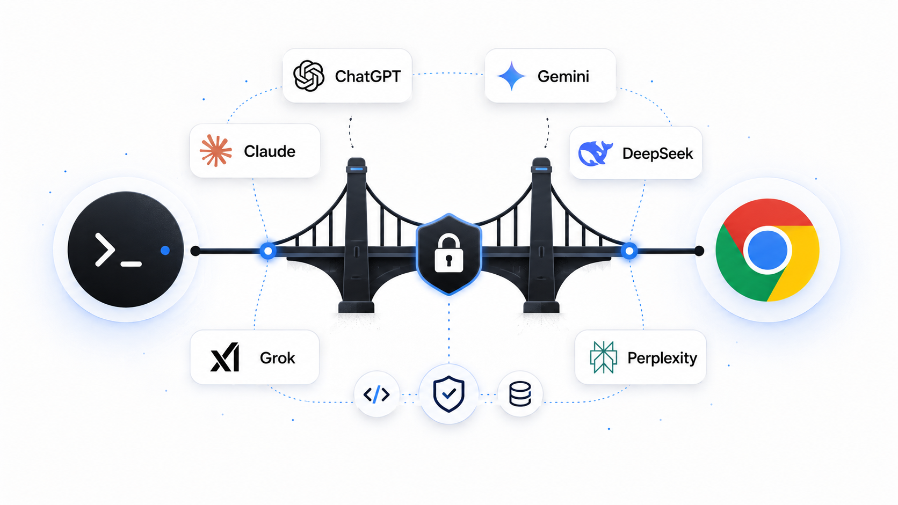

<p align="center">
  
</p>

# ai-browser-bridge

[English](README.md) · [עברית](README.he.md) · [Español](README.es.md) · **中文**


---

> 从终端驱动真实的 ChatGPT 或 Gemini 浏览器会话，并通过 MCP 给 ChatGPT 一组受限的本地仓库工具——永远不交给它一个 shell。

## 为什么需要它

ChatGPT 在浏览器中表现最佳——真实的账户状态、模型选择器、消息编辑、重新生成以及会话历史都完整保留。而写代码在终端中最高效，可以直接检查和修改文件、测试、diff 与补丁。

`ai-browser-bridge` 把这两个界面连接起来。终端中的一个提示词驱动你现有的提供商浏览器会话，而 ChatGPT 可以通过一小组**经过校验的 MCP 工具**——`grep`、`read`、`apply_patch`、`run_tests`、`git_diff`——访问当前仓库，而不是获得原始 shell 访问权限。你始终停留在单一的终端工作流中；提供商保留其真实界面。

## 功能

- **九个提供商，一个命令** — ChatGPT、Gemini、Claude、DeepSeek、Grok、Perplexity、Duck.ai、Arena 与 Google Flow。使用 `--provider` 选择一个，或并行询问多个。
- **面向智能体** — `bridge ask … --json` 提供稳定的非交互接口，`bridge serve` 则暴露出站 MCP 工具。
- **通过 MCP 的沙箱化本地工具** — 每个文件操作都针对所选仓库根目录进行校验；没有任意 shell，仅允许白名单内的测试命令。
- **浏览器操作即命令** — `/resume`、`/new`、`/model`、`/rewind`、`/stop`、`/context`、`/diff`、`/compact` 等。
- **仓库根目录中的会话、记录与下载** — 持久化运行始终使用 `<repo>/.bridge/`，即使从子目录启动也是如此。
- **安全控制** — 权限模式（`read-only` / `ask` / `auto`）以及每次补丁前后的自动文件检查点。
- **项目约定** — 自定义命令以及 `AGENTS.md` / `CLAUDE.md` 会在 `/task` 运行时提供给 ChatGPT。
- **真正的输入器** — 提示词历史、反向搜索、提示词排队，以及 `@file` 提及的自动补全。

## 架构

```text
 terminal (you)
      │
      │  Ink / React CLI
      ▼
 orchestrator ──────────────┬───────────────────────────────┐
      │  browser automation │                   MCP server   │
      ▼  (Playwright + CDP) │                  (MCP SDK)      ▼
 ChatGPT browser UI         │                        local repo tools
      ▲                     │                     (grep/read/patch/test/diff)
      │                     ▼                                 │
      └───── Cloudflare Tunnel (cloudflared) ◄────────────────┘
              public https://…trycloudflare.com/mcp
```

四个层，各司其职：

| 层 | 技术 | 职责 |
|----|------|------|
| **CLI** | Ink / React | 终端界面：消息面板、状态栏、`@file` 提及、`/` 命令。 |
| **浏览器** | Playwright + Chrome DevTools Protocol | 通过调试端口连接 Chrome，并复用唯一的共享 bridge 配置文件。提供商适配器位于 `src/features/providers/`。 |
| **MCP 服务器** | MCP SDK + Effect Schema | 向 ChatGPT、Claude 与 Grok 暴露经过校验且沙箱化的本地工具。 |
| **隧道** | Cloudflare Tunnel (`cloudflared`) | 为本地 MCP 服务器提供一个临时的公共 HTTPS 地址，供 ChatGPT 连接器访问——无需部署。 |

**为什么需要隧道？** ChatGPT 的 MCP 连接器通过 HTTPS 调用工具，但工具服务器运行在你的机器上。与其部署任何东西，bridge 在本地端口前面启动一个临时的 Cloudflare 隧道（`*.trycloudflare.com`），并在启动时把该 `…/mcp` 地址同步到 ChatGPT 应用中。（ngrok 也能解决同样的可达性问题；这里使用 Cloudflare 的 `cloudflared`，因为它的快速隧道无需账户或令牌。）

## 快速开始

**前置条件**

- **macOS** — Chrome 从 `/Applications/Google Chrome.app` 启动，剪贴板/进程辅助使用 `pbcopy`/`lsof`。
- **Node.js ≥ 22** 与 **pnpm**（仓库锁定 `pnpm@10.14.0`）。
- **Google Chrome 或 Chrome for Testing** — bridge 复用 `~/.ai-browser-bridge/chrome-profile` 中的全局共享配置文件。
- **`cloudflared`** *（可选）* — ChatGPT、Claude 或 Grok 调用本地工具时需要。没有它 TUI 仍可运行。安装：`brew install cloudflared`。

**安装与构建**

```bash
git clone https://github.com/YosefHayim/ai-browser-bridge.git
cd ai-browser-bridge
pnpm install
pnpm build
```

**启动 Chrome，然后运行**

```bash
# 打开 bridge 的共享 Chrome 配置文件；如有需要请登录
node dist/bridge.js chrome start

# 针对你希望 ChatGPT 操作的仓库启动终端界面
node dist/bridge.js --repo /path/to/your/project
```

想要一个全局 `bridge` 命令？构建后运行 `pnpm link --global`，然后使用 `bridge`、`bridge chrome start`、`bridge ask "…"` 等。

## 智能体与提供商

`bridge ask` 可以询问单个提供商，也可以把同一问题并行发送给多个提供商。结果按提供商返回，部分失败不会丢弃成功结果。

```bash
bridge ask --provider claude --json "summarize this repo"
bridge ask --provider claude,deepseek,grok --json "compare these approaches"
bridge serve
```

`bridge serve` 通过 MCP stdio 提供 `ask` 与 `search_conversations`。ChatGPT、Claude 与 Grok 可使用入站 MCP 连接器；Gemini、DeepSeek、Perplexity、Duck.ai 与 Arena 作为网页聊天运行，Flow 则作为视频生成界面运行。

## 状态保存在哪里

某个项目的所有 bridge 状态都写入 Git 工作树规范根目录下的 `<repo>/.bridge/`。即使从子目录启动，也只会使用这一处根目录；显式指定的非 Git 目录仍以自身作为根目录。bridge 不会创建或管理 `.bridge/.gitignore`；忽略策略由目标仓库自行决定。

> 由用户编写、意在应用于**所有**仓库的配置位于你的主目录中：自定义命令在 `~/.ai-browser-bridge/commands/*.md`，用户级 hooks 在 `~/.ai-browser-bridge/hooks.json`。

## 权限与检查点

```bash
/permissions read-only   # grep_code, read_file, git_diff
/permissions auto        # 以及受限的写入/测试工具
/permissions ask         # 阻止写入/测试/进程工具（交互式确认待实现）
```

`apply_patch` 会在变更前后对每个涉及的路径进行快照。使用 `/checkpoints`、`/restore <id>` 或 `/rewind --files <id>` 恢复。

## 测试

```bash
pnpm test          # vitest run
pnpm typecheck     # tsc --noEmit
pnpm verify:push   # Biome + typecheck + tests + build + 结构检查
```

覆盖率聚焦于安全敏感路径——沙箱校验、规范仓库根目录解析、会话/检查点存储、权限以及上下文计数。

## Google Flow 支持

bridge 也可以驱动 **[Google Labs Flow](https://labs.google/fx/tools/flow)**——Google 基于 Veo 的 AI 视频工作室——采用与聊天类提供商相同的 Playwright/CDP 模式。Flow 与聊天类提供商本质不同：它是一个**生成**界面，因此“回复”是一段渲染出的**片段（clip）**，而附件则是**素材（ingredients）**（参考图像）。

```bash
bridge chrome start --provider flow    # 登录 Google；账户需要 Flow 访问权限（AI Pro/Ultra）
bridge ask --provider flow "a cat surfing a neon wave, cinematic, 8s"
bridge ask --provider flow "same scene, dawn light" --attach ref1.png ref2.png   # 最多 3 个素材
```

除了生成之外，bridge 还通过 `bridge flow` 子命令驱动 Flow 完整的**素材生命周期**（每个子命令都会附着到你当前的 Flow 项目标签页；添加 `--json` 可获得机器可读的输出）：

```bash
bridge flow clips                        # 列出当前项目中的片段（id + 可获取的 URL）
bridge flow download                     # 将片段下载到 <repo>/.bridge/downloads/flow
bridge flow reuse   --id <clipId>        # 将片段作为输入重新加入提示词（"Add to prompt"）
bridge flow extend  --id <clipId>        # 将片段加入场景（Flow 的 "Add to scene"）
bridge flow rename  --id <clipId> --name "hero shot"
bridge flow delete  --id <clipId> --yes  # 将片段移入 Flow 回收站（可恢复）
bridge flow ingredients                  # 列出附加到提示词的参考图像
bridge flow ingredient-remove --id <mediaId>   # 移除单个素材
bridge flow ingredient-clear             # 移除全部素材
bridge flow projects                     # 列出项目
bridge flow project-rename --name "Launch teaser"
bridge flow project-delete --yes         # 永久删除当前项目
```

破坏性动词（`delete`、`project-delete`）需要 `--yes`；删除片段会将其移入 Flow 可恢复的回收站。

没有 shell 访问权限的智能体可以通过 `bridge serve` 以 **`flow_*` MCP 工具**的形式获得相同的生命周期——`flow_list_clips`、`flow_download_clips`、`flow_reuse_clip`、`flow_extend_clip`、`flow_rename_clip`、`flow_delete_clip`、`flow_list_ingredients`、`flow_remove_ingredient`、`flow_clear_ingredients`、`flow_list_projects`、`flow_rename_project`、`flow_delete_project`。破坏性工具（`flow_delete_clip`、`flow_delete_project`）需要 `confirm: true`。

**Flow 上可用的功能**

- 从终端驱动、触发 Veo 生成的镜头提示词
- **素材（ingredients）** — 为提示词附加最多三张参考图像，并列出 / 移除 / 清空已附加的素材
- 捕获到的**片段引用**（视频的 `src` / 下载 href）作为回复返回，因此智能体能获得指向结果的指针
- **素材 CRUD** — 列出 / 下载 / 重命名 / 删除片段，扩展或复用片段，管理提示词素材，以及列出 / 重命名 / 删除项目 — 既可作为 `bridge flow …` CLI 命令，**也可**作为通过 `bridge serve` 提供的 `flow_*` MCP 工具
- 复用与所有提供商相同的共享 bridge 配置文件 / 调试端口模型

**Flow 上尚不可用的功能（当前）**

- **MCP 连接器**、**`/task`**、**`/connector`**、**`/mcp`** — Flow 没有连接器界面，因此会跳过 MCP 服务器和 Cloudflare 隧道（与 Gemini 相同）。
- **停止 / 渲染中途控制** — 尚未接入对进行中的 Veo 渲染的取消功能。

Flow 需要 **Google AI Pro/Ultra** 套餐。由于 Veo 渲染需要数分钟，`--provider flow` 等待响应的时间远比聊天类提供商更长。

**选择器维护：** Flow 的选择器已针对已登录的项目编辑器**实时验证（LIVE-VERIFIED）**。如果 Google 更改了 UI，请使用 `node src/scripts/maintain/captureProviderSelectors.mjs` 重新捕获，然后更新 [`src/config/index.ts`](src/config/index.ts)；生成逻辑位于 [`src/features/providers/flow/flowPage.ts`](src/features/providers/flow/flowPage.ts)，素材 CRUD 位于 [`src/features/providers/flow/flowAssets.ts`](src/features/providers/flow/flowAssets.ts)。

## 限制

- 目前**仅支持 macOS**（硬编码的 Chrome 路径以及 `pbcopy`/`lsof` 辅助）。
- 当提供商的网页界面变动时，选择器可能失效；修复集中在对应适配器中。
- 上下文用量是**估算值**——浏览器不暴露服务器端的精确 token 计数。
- Cloudflare 隧道需要已安装 `cloudflared`。
- 设计上以本地优先；并非托管的多用户服务。
- Hook 命令执行会被解析和报告，但尚未实际执行。

## 许可证

[MIT](LICENSE) © YosefHayim
